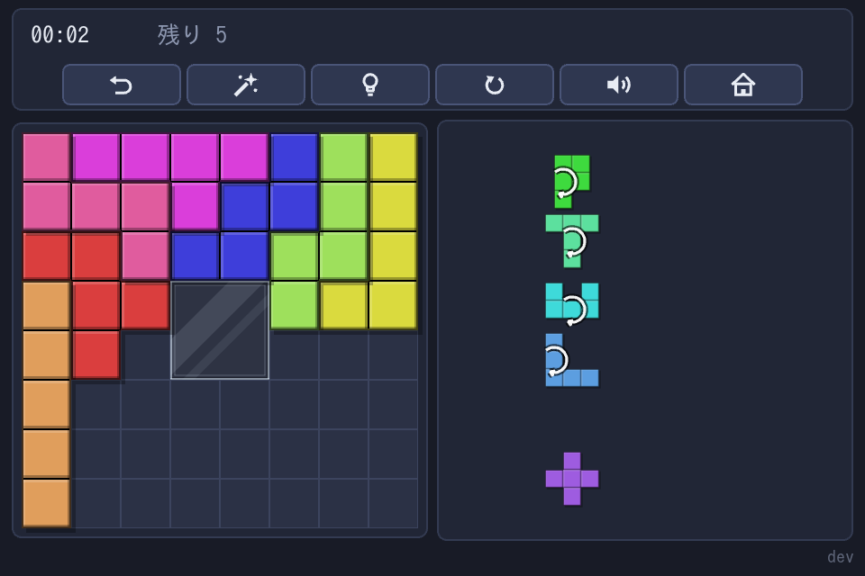

# Pentomino Puzzle

ブラウザで遊ぶペントミノの敷き詰めパズル。ビルド工程は無く、ファイルをそのまま配信すれば動く。

**遊ぶ（公開版）**: https://ytani01.github.io/pentomino-puzzle/



12 種のピースを右のトレイから左の盤へ運び、隙間なく敷き詰めれば完成。
デモでは、コンピューターがピースを置いては外しながら解を探す。


- **依存は Phaser 3.90.0 だけ**（CDN、バージョン固定）。npm は使わない
- 画像・音声ファイルを持たない（`docs/images/` は文書用で、ゲームは読まない）。絵は実行時に描き、効果音は Web Audio API で合成する
- マウスでもタッチでも遊べる
- 盤は **8×8**（中央 2×2 が穴）と **6×10**（穴なし）の 2 つ。どちらも置けるマスは
  60 で、ペントミノ 12 種（F I L N P T U V W X Y Z）をすべて置くと完成。解は
  回転・反転で同じものを 1 つと数えて、8×8 が 65 通り、6×10 が 2339 通り
- **その全解をあらかじめデータとして持つ**（`src/data/`）ので、**おまかせと
  ヒント表示は探索せず待たされない**
- コンピューターが探索してピースを置いたり外したりしながら解を見つける
  様子を眺められる**デモ**もある
- **遊ぶのにも公開するのにも Node.js は要らない。** 要るのは
  [全解のデータ](docs/developer.md#全解のデータ)を作り直すときだけ

## 遊ぶ

`file://` では ES Modules が読めないので、ローカルサーバ経由で開く。

```bash
python3 -m http.server 8765
#   http://localhost:8765/
```

遊び方の詳細（操作、HUD のボタン、記録、つづきから、デモ）は
[docs/UsersGuide.md](docs/UsersGuide.md) にある。

## 開発者向け

ファイル構成、構成（層の分け方・シーンの移り方）、画面の用語、テスト、記録の保存、全解のデータ、GitHub 上の設定は
[docs/developer.md](docs/developer.md) にある。

## ライセンス

MIT
