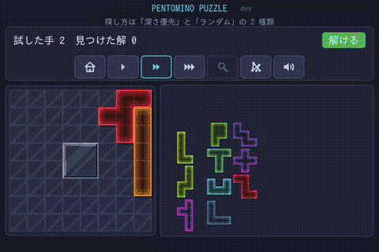

# Pentomino Puzzle

12 種のペントミノを、盤に隙間なく敷き詰めるパズル。ブラウザだけで遊べる。

### ▶ [いますぐ遊ぶ](https://ytani01.github.io/pentomino-puzzle/)

インストールも登録も要らない。パソコンでもスマホでも、マウスでもタッチでも遊べる。

## 遊び方

右のトレイからピースを左の盤へドラッグして置く。ピースをタップすると
向きが変わる（回転と裏返し）。12 枚すべてを隙間なく置けば完成。

- 置く場所は多少ずれていても、近くの置けるマスへ吸い付く
- 盤は **8×8**（中央に穴）と **6×10** の 2 つ。解は 8×8 が 65 通り、
  6×10 が 2339 通り（回転・反転で同じものは 1 つと数える）
- 詰まったら **ヒント表示** で「まだ解けるか」が分かり、**おまかせ** で
  1 枚ずつ置いてもらえる。どちらも待たされない
- クリアすると、それが何番目の解かが出る。見つけた解と最短時間は記録に残り、
  全解のうちいくつ見つけたかを見返せる
- 途中でやめても、次は **つづきから** 再開できる

## デモ

コンピューターがピースを置いては外しながら、解を探し当てる様子を眺められる
（上の画像を押すと、デモが直接開く）。

操作、画面上のボタン、記録、デモの詳しい説明は
[遊び方（docs/UsersGuide.md）](docs/UsersGuide.md) にある。

## 開発者向け

ローカルでの動かし方、依存、ファイル構成、テスト、全解のデータ、公開の手順は
[docs/developer.md](docs/developer.md) にある。

## ライセンス

MIT
