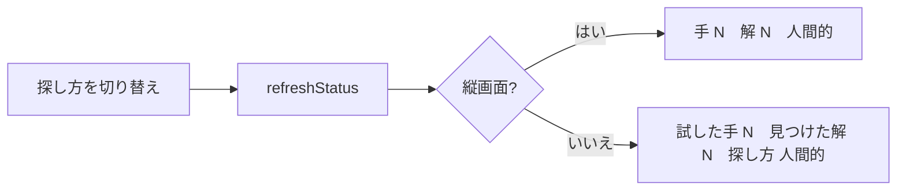

# TODO-102. デモの既定の速さを「ゆっくり」にし、今の探し方を HUD に出す

|      | main | 担当 |
|------|------|------|
| 見込み | Opus 5.5 / effort medium | main（実装）+ reviewer（Opus 5.5 / high）+ screens（Sonnet 5.5 / low） |
| 実施 | Opus 5.5 / effort 不明 | main（実装・キャプチャの撮り直し）+ reviewer（Opus 5.5 / high）+ screens（Sonnet 5.5 / low。同じ担当に 2 回） |

| 担当 | モデル | effort | input | output | cache_creation | cache_read | 割合 |
|------|--------|--------|-------|--------|----------------|------------|------|
| main | Opus 5.5 | 不明 | 68 | 13,386 | 31,139 | 2,606,236 | 75% |
| screens | Sonnet 5.5 | low | 26 | 553 | 43,372 | 406,748 | 13% |
| reviewer | Opus 5.5 | high | 20 | 100 | 53,592 | 359,889 | 12% |
| 合計 |  |  | 114 | 14,039 | 128,103 | 3,372,873 | 計 3,515,129 |

- main の effort はセッションの設定で、記録に残っていない
- reviewer の定義は `~/.claude/agents/reviewer.md`（opus / high）。上書きしていない
- サブエージェントの分は少なめに出ている可能性がある（`token-usage.py` の制約）

## きっかけ

利用者の依頼。デモの既定を「人間的」「ゆっくり」にし、今の探し方を見えるようにしたい。
探し方の既定はすでに人間的だったので、速さだけを変えた。途中で「人間的の手の間隔を
200〜2000ms にする」が加わった。

## やったこと

- `src/config.js`: `DEMO.defaultSpeed` を `'slow'` に。`randomJitter`（±0.5）を
  `randomWaitMin`（0.5）・`randomWaitMax`（5）に替え、待ち時間の倍率を一様に引く
  （ゆっくりで 200〜2000ms、速いで 100〜1000ms。外す手は今どおりその 2 倍）
- `src/scenes/demo.js`: HUD の 1 段目に今の探し方を出す。横は
  「試した手 N　見つけた解 N　探し方 人間的」、縦は「手 N　解 N　人間的」
  （縦は 5 桁で右端の札に隠れたため。利用者が詰める案を選んだ）。
  探し方を切り替えたら、全解のデータを待っている間でも書き換える
- `docs/UsersGuide.md`・`docs/developer.md`: 既定の速さ、1 段目の探し方、待ち時間の幅
- `tools/capture.mjs` の注記の文言を直し、`docs/images/demo.png` を撮り直した
  （他の画像と `demo.gif` は撮り直した分を戻した。GIF は `?demo=random` で開き、
  速さが変わって見え方が変わるが、今回は撮り直していない）

## 確かめたこと

- reviewer: 表示と今の探し方が食い違う経路は無し。旧名 `randomJitter` の残りも無し。
  `demo.png` が古い点と、文書の待ち時間が置く手だけの値である点を指摘 → どちらも直した
- screens: 最も長い文字（試した手 99,999・解 99・解なし）で、横 960×640 は札まで余白 197。
  縦 390×844 は直す前に札へ 123px かぶり、直したあとは余白 150
  （`archives/agents/TODO-102/screens-report.md`）
- main が撮り直した `demo.png` と縦画面の画像を目で見た

## 残ること

- README の `docs/images/demo.gif` は撮り直していない。次に撮り直すと、既定がゆっくりに
  なった分、同じ秒数で動く手が減る

## 分担の振り返り

- reviewer はキャプチャの文言と画像が古いことを見つけた。main は見落としていた
- screens は縦画面で札に隠れることを数値で見つけた。見込みどおり、ここが一番の問題だった
- 見込みとの食い違いは、キャプチャの撮り直しが増えたことと、screens への 2 回目の依頼だけ
- 次に HUD の文字を変える項目では、screens への依頼に最初から「縦で収まらないときの候補」を
  持たせず、先に最長の文字の幅を main が `evaluate` で 1 回測ってから案を決める。
  キャプチャに写る文字を変えるときは `tools/capture.mjs` の注記も見直す対象に入れる
