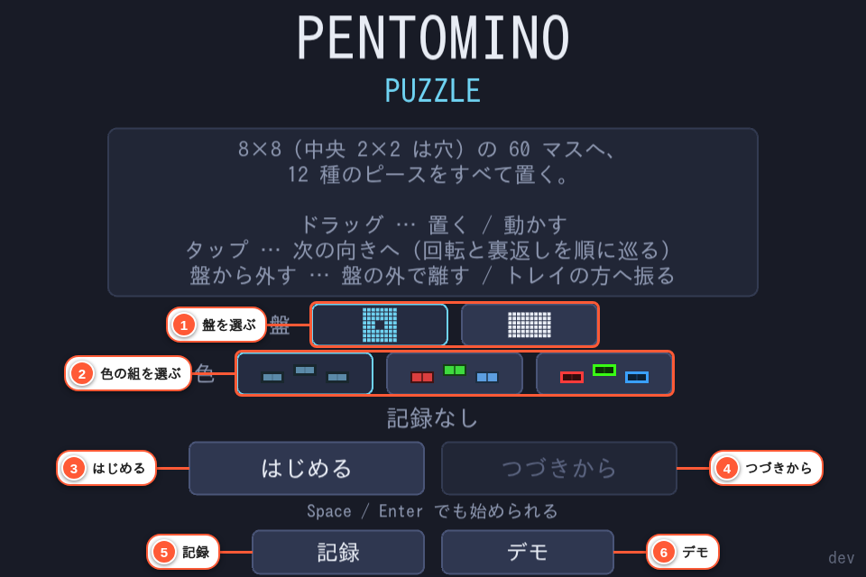
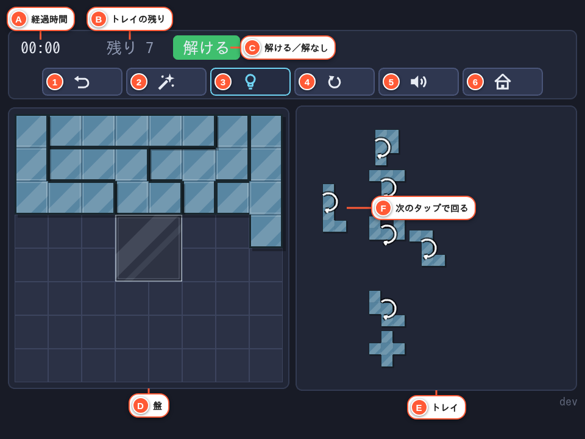
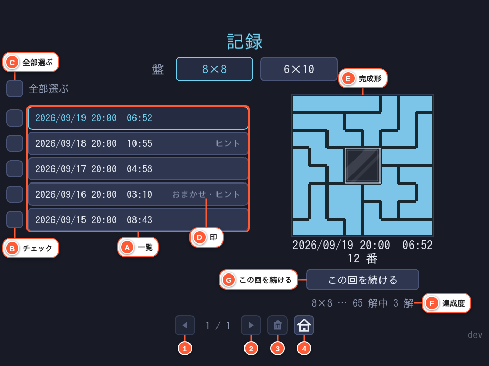
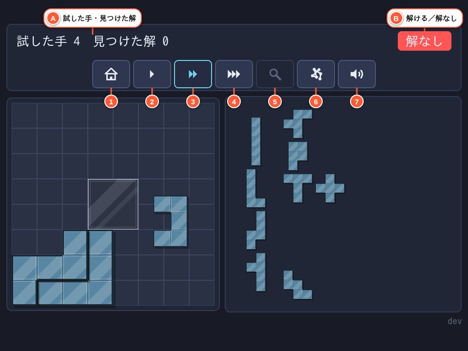

# 遊び方

このアプリの概要は [README.md](../README.md) にある。ここでは、実際に
触るときの操作や画面の細かい挙動をまとめる。

## 盤と色を選ぶ

タイトル画面の ① で、盤を **8×8**（中央 2×2 が穴）と **6×10**（穴なし）から選ぶ。
どちらも置けるマスは 60 で、ペントミノ 12 種（F I L N P T U V W X Y Z）を
すべて置くと完成。解は回転・反転で同じものを 1 つと数えて、8×8 が 65 通り、
6×10 が 2339 通り。

色の組は ② の行で選ぶ。盤の選択は遊ぶたびに選び直す前提（起動すると既定へ
戻る）だが、色の組はブラウザに覚えておき、次回も同じ組で始まる。

③ **はじめる** で空の盤から、④ **つづきから** で遊びかけの盤から始める
（[つづきから](#つづきから)）。⑤ **記録** と ⑥ **デモ** は下の節で説明する。
盤と色の選択肢は図で出ていて、マウスを載せると名前が出る。

## 操作

左の Ⓓ が**盤**、右の Ⓔ が**トレイ**（まだ置いていないピースの置き場）。
トレイのピースを盤へ運んで置いていく。

| 操作 | 割り当て |
|---|---|
| ピースを置く / 動かす | ドラッグ |
| 次の向きへ（回転と裏返しを順に巡る） | ピースをタップ |
| 盤から外す | 盤の外で離す / トレイの方へ振る |
| ドラッグ中に次の向きへ（スマホ） | もう 1 本の指でどこかをタップ |
| ドラッグ中に次の向きへ（PC） | 右クリック / ホイールを下へ |
| ドラッグ中に 1 つ前の向きへ（PC） | ホイールを上へ |

置く場所は多少ずれていても、近くの置けるマスへ吸い付く。どこにも置けない
場所で離すと、赤く光って元の場所へ戻る。盤に置いたままタップしたときは、
そこに置けない向きは飛ばして次の置ける向きへ進む。

ドラッグ中も向きを変えられる。つかんでいるマス（タッチでは、指から
マス 1 個ぶんずらした先にあるマス）は、向きを変えても画面上の同じ位置に
残る。ドラッグ中は盤から外れているので、
盤に置けない向きも飛ばさずに巡る。

トレイのピースには、次にタップしたときにどう変わるかの印が出る（Ⓕ）。
丸い矢印は回転、左右の矢印は裏返し。向きが 1 通りしかない X には出ない。

## HUD のボタン

画面上端に、Ⓐ 経過時間・Ⓑ トレイに残っているピースの数・Ⓒ 解の有無と、アイコンのボタンが並ぶ
（番号は[上の図](#操作)）。
マウスを載せると（タッチ端末では押すと）何のボタンかが出る。

| 番号 | ボタン | 動き |
|---|---|---|
| 1 | 一手戻す | 直前の 1 手を戻す |
| 2 | おまかせ | 押すたびに 1 個だけ、全解のデータから選んだ手を盤へ置く |
| 3 | ヒント表示 | 入にすると、置く・外すたびに残りのピースで最後まで置けるかを調べ、「解ける」「解なし」を HUD に出す |
| 4 | やり直し | 盤を空にして最初から |
| 5 | 音 ON・OFF | 効果音の切り替え |
| 6 | タイトルへ | 確認を挟んでタイトルへ戻る |

**ヒント表示**を入にすると、周りから切り離された 5 マスの空きが残りの
ピースと同じ形なら、そのピースを自動で置く（一手戻すと、直前の手と
まとめて戻る）。自動で置くのは、ピースを置いたときと入にしたときだけで、
外したとき・一手戻したときは置かない（外したピースがすぐ埋め戻されないように）。**おまかせとヒント表示は全解のデータを引くだけ**
（`src/data/`）なので待たされない。どちらも使うと、その回の記録は
最短時間の更新に入らない（履歴には「おまかせ」「ヒント」の印が付く）。

## クリアと番号

盤が埋まると時計が止まり、盤の上にクリアの表示が重なって「正解の何番か」が出る。
回転・反転して置いても同じ番号になる。最短時間とクリアした解はブラウザに
保存され、**記録**の画面で見返せる。

クリアの表示には 4 つのボタンが並ぶ。

| ボタン | 動き |
|---|---|
| 続ける | 表示を閉じ、完成した並びのまま時計を動かして遊び続ける。ピースを入れ替えて別の解を作れる |
| もう一度 | 空の盤から新しく始める（完成した盤面は残さない） |
| 記録 | 記録の画面へ |
| タイトルへ | タイトルへ戻る |

完成した解が記録に対してどうなったかを、クリアの表示と HUD（Ⓒ の位置）に出す
（HUD には「新しい解（6 番）」のように番号を添える。ピースを外して盤が
埋まっていない状態になると消える）。

- **新しい解** — 記録に無い解だったので、記録に足した
- **記録を更新** — 記録にある解だが、今回のほうが成績がよいので書き換えた
- **記録済み** — 記録にある解で、前の記録のほうがよいか同じなので、何も変えない

記録は **1 つの解に 1 件** だけ持つ。成績は、おまかせ・ヒント表示の印が
無いほうをよいとし、印の有無が同じなら経過時間の短いほうをよいとする。
経過時間は、続けて遊んだぶんも含めて最初からの累計で比べる。

## つづきから

遊びかけでタイトルへ戻っても、盤面と経過時間はブラウザに残る。
タイトルの **つづきから** で再開できる（盤ごとに 1 つずつ持つので、
8×8 を途中にしたまま 6×10 を始めても、どちらの続きも残る）。
ただし**一手戻す履歴は持ち越さない**ので、再開した直後は戻せない。

完成した盤面も残る。クリアの表示で **記録** か **タイトルへ** を選んだあとも、
**つづきから** で完成した並びから続けて遊べる（**もう一度** を選ぶと消える）。

記録の画面の **この回を続ける**（[記録の画面](#記録の画面)）で始めたときも、
その盤の遊びかけは選んだ回の盤面に置き換わる。

## 記録の画面

タイトルの **記録** から入る。

- Ⓐ **一覧** — クリアした回を新しい順に並べる。行を押すと右に**完成形**（Ⓔ、
  選んだ回の完成した盤面を縮小して描く）が出る
- Ⓑ 各行の左端の**チェックボックス**は常に出ていて、押すと選ぶ／外すができる
  （Ⓐ を押すのとは別の当たり判定。行を見るのとチェックするのは別の操作）
- Ⓒ 一覧の上の **全部選ぶ** は、見えていない頁の分も含めてその盤の記録すべてを
  選ぶ／外す
- Ⓓ 一覧の行の右端には、その回が**おまかせ**・**ヒント表示**のどちらに
  頼ったかの印が出る（両方使えば「おまかせ・ヒント」）
- Ⓕ **達成度** — 「8×8 … 65 解中 12 解」のように、その盤の全解のうち何解を
  見つけたかを出す
- Ⓖ **この回を続ける** — 選んでいる回の完成形を盤に並べた状態から本編を始める。
  盤は記録の画面で見ている盤に切り替わる。経過時間はその回の時間から数え、
  おまかせ・ヒント表示の印もその回のものを引き継ぐ（何手か入れ替えるだけで
  短い時間や印の無い記録を作れないようにするため）。並べた直後の盤はその回の
  解なので、新しい記録にはならない。その盤に遊びかけがあるときは、
  「遊びかけの盤面が消えます」と確認してから置き換える（無ければ確認しない）

画面下の 1 段にアイコンのボタンが並ぶ。

| 番号 | ボタン | 動き |
|---|---|---|
| 1 | 前へ | 前の頁へ |
| 2 | 次へ | 次の頁へ |
| 3 | ゴミ箱 | チェックした回をまとめて消す。チェックが 1 件以上のときだけ押せ、押すと消す前に何件消すか確認する（1 件だけでも、複数でもよい） |
| 4 | タイトルへ | 確認無しでタイトルへ戻る |

盤を切り替えるとチェックは外れるが、頁を送ってもチェックは残る。

## デモ

タイトルの **記録** の横にある **デモ** を押すと、選んでいる盤と色の組で、
空の盤からコンピューターが探索してピースを置いたり外したりしながら
解を見つける様子を眺められる。記録・遊びかけ・見つけた解には何も残らない。
置き方は、ヒント表示を入にして解くときと同じで、置いて「解なし」と出たら
すぐに外して次を試す。HUD にも本編と同じ「解ける／解なし」を出す（Ⓑ）。

画面上端のボタンは本編と同じくアイコンで、マウスを載せると（タッチ端末では
押すと）何のボタンかが出る。速さは **ゆっくり**・**速い**・**最速**
から選べる（右向きの三角が 1・2・3 個）。どの速さでも 1 手ずつ進むので、
置いては外す様子を目で追える。解を見つけると 10 秒止まり、そのあと
自動で次の解を探すので、**タイトルへ** を押すまで止まらない。待たずに
進めたいときは **次の解を探す**（虫眼鏡）を押す。次の解は盤を片づけて
最初から探し直す。
試した手数と見つけた解の数を画面に出す（Ⓐ）。試した手数は最初から探し直すたびに
0 に戻る。見つけた解の数は探し方を切り替えると 0 に戻る。

**探し方** のボタンで、深さ優先（歯車）とランダム（「？」）を
切り替えられる。既定は深さ優先で、左上の空いたマスから順に埋めていく。
ランダムは、残りのピースから 1 枚を選び、向きも含めて置き場所を選んで置く。
ピースは、置ける手が一番少ない空きマス（「狭い所」）を覆えるものが選ばれやすい
（隙間に入るピースを探して選ぶように見せるため）。置き場所は、盤の端や
置いたピースの隣、直前に置いた手の近くが選ばれやすい。選んだピースが
狭い所を覆えるときは、置き場所も狭い所を覆う手に絞られる。5 マスの穴に残りの
ピースがちょうど合うときは、他の置き方より先にそのピースで埋める。
盤へ滑らせる前に、トレイでの今の向きから置く向きまで回転・裏返しで合わせてから置く
（手に取って向きを合わせる動きに見せるため）。
「解なし」と出てもすぐには外さず、置ける場所が無くなるまで置き続け、
そこから「解ける」に戻るまで 1 手ずつ外す。ただし、5 の倍数でない大きさの
閉じた空きができたとき、5 マスの穴を埋めた直後に「解なし」になったとき、置き済みの
ピースと同じ形の 5 マスの空きができたときだけは、埋めようが無いのが明らかなので
置いた直後に外す（穴を埋めた場合は、その前に置いた手もまとめて外す）。
置ける場所が無くなって戻る「詰まり」が、同じところ（盤に残るピースの数）で
何度も続くと、1 手ずつでなく数手まとめて外し、大きく崩してやり直す
（置いた直後にその場で外す手は詰まりに数えない。人は同じ所で詰まり続けると
「やり直そう」と崩すため）。
1 手の間隔も少しずつ揺れるが、
外す手が連なるとき（深さ優先・ランダムのどちらも）は待たずに続けて動かす。
置いた手そのものは今までどおりの間隔で見える。
切り替えると空の盤から探し直す。音の ON・OFF と **タイトルへ** も
同じ画面にある。

| 番号 | ボタン | 動き |
|---|---|---|
| 1〜3 | ゆっくり・速い・最速 | 探索の速さ |
| 4 | 次の解を探す | 解を見つけて止まっているときだけ押せる |
| 5 | 探し方 | 深さ優先とランダムを切り替える |
| 6 | 音 ON・OFF | 効果音の切り替え |
| 7 | タイトルへ | 確認を挟まずにタイトルへ戻る |
