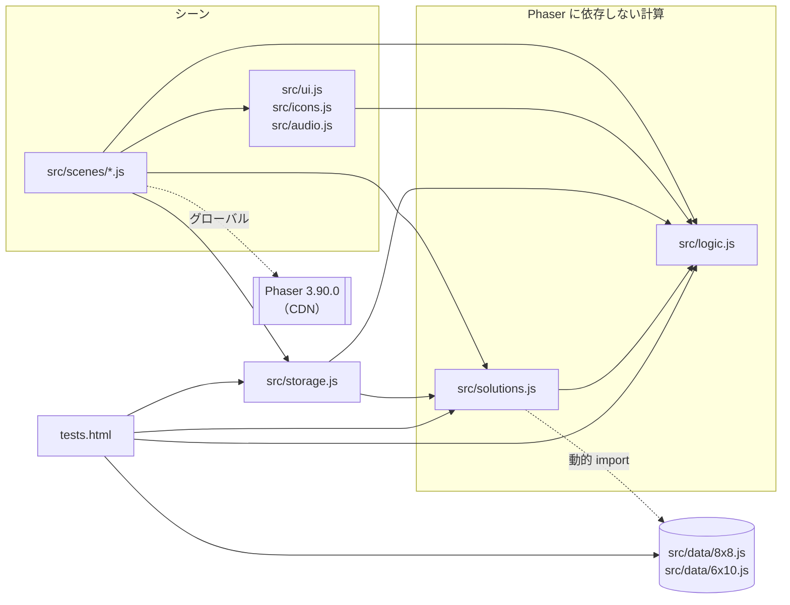
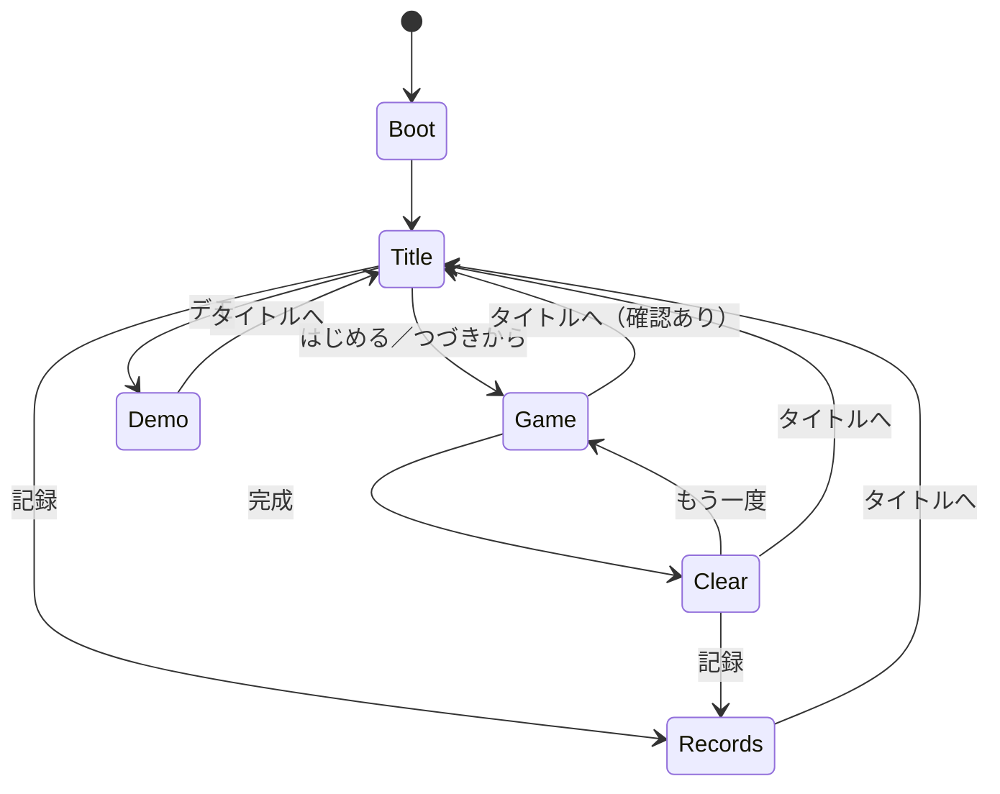
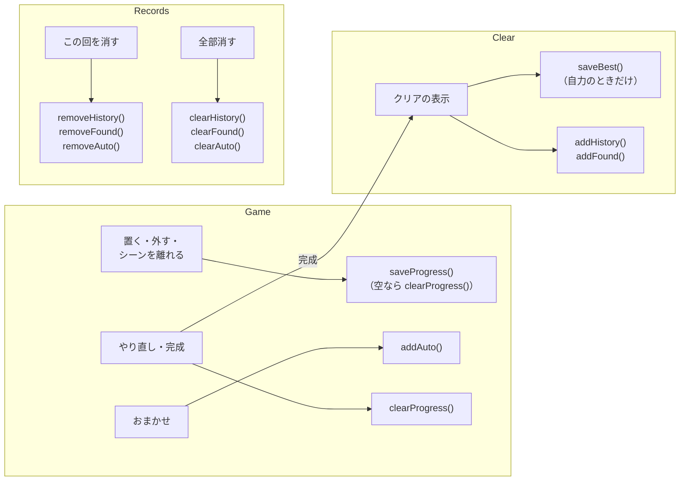

# 開発者向けの覚書

コードを読んだだけでは分かりにくいものをまとめる。

- [動かす](#動かす) — ローカルでの起動、依存、Node.js が要る場面
- [ファイル構成](#ファイル構成) — リポジトリのファイルの役割
- [構成](#構成) — 3 層の分け方、シーンの移り方、registry のキー
- [画面の用語](#画面の用語) — ソースとやり取りで使う呼び名
- [テスト](#テスト) — `tests.html` の対象
- [記録の保存](#記録の保存) — `src/storage.js` が localStorage に持つもの
- [全解のデータ](#全解のデータ) — `src/data/*.js` の作り方と、作り直すとき
- [サブエージェントの定義](#サブエージェントの定義) — `.claude/agents/*.md` の役割と受け持ち
- [GitHub 上の設定](#github-上の設定) — 利用者が手動で設定する必要があるもの

遊び方（操作・HUD・記録・デモ）は [docs/UsersGuide.md](UsersGuide.md) にある。

---

## 動かす

ビルド工程は無く、ファイルをそのまま配信すれば動く。`file://` では
ES Modules が読めないので、ローカルでもサーバ経由で開く。

```bash
python3 -m http.server 8765
#   http://localhost:8765/           … パズル本体
#   http://localhost:8765/tests.html … 計算のテスト
```

- **依存は Phaser 3.90.0 だけ**（CDN、バージョン固定）。npm は使わない
- 画像・音声ファイルを持たない（`docs/images/` は文書用で、ゲームは読まない）。
  絵は実行時に Graphics API で描き、効果音は Web Audio API で合成する
- 盤ごとの全解をあらかじめデータとして持つ（`src/data/`）ので、おまかせと
  ヒント表示は遊んでいる間に探索しない（[全解のデータ](#全解のデータ)）
- **遊ぶのにも公開するのにも Node.js は要らない。** 要るのは
  [全解のデータを作り直す](#作り直す)ときと、`tools/capture.mjs` で
  文書のキャプチャを撮り直すときだけ

---

## ファイル構成

```
index.html            HTML / CSS と Phaser の読み込み
src/
  main.js             Phaser の起動
  config.js           盤面・ピース・色・レイアウトの定数
  logic.js            Phaser に依存しない計算（tests.html の対象）
  solutions.js        全解のデータの読み込みと照合（tests.html の対象）
  data/
    8x8.js            8×8 の全解（65 件）。tools/gen-solutions.mjs が作る
    6x10.js           6×10 の全解（2339 件）。同上
  audio.js            Web Audio API による効果音
  storage.js          クリア記録と遊びかけの保存
  ui.js               ボタンと枠（5 つのシーンで共通）、穴のアクリルの板
  icons.js            HUD のボタンのアイコンと、タイトルの盤・色の選択肢の図
  scenes/
    boot.js           マス目テクスチャの生成
    title.js          タイトル
    game.js           本編
    clear.js          クリア表示
    records.js        クリア記録の一覧
    demo.js           コンピューターが解を探す様子を見せるデモ
tools/                開発時にだけ使う（公開しない）
  enumerate.mjs       全解の数え上げ
  gen-solutions.mjs   src/data/*.js を作る／突き合わせる
  window-shim.mjs     Node から src/ を読むためのダミーの window
  capture.mjs         docs/images/ のキャプチャを撮り直す
tests.html            計算のテスト
docs/
  UsersGuide.md       遊び方の詳細（操作、HUD、記録、デモ）
  developer.md        ファイル構成、構成、画面の用語、テスト、記録の保存、全解のデータ、GitHub 上の設定
  images/             文書に載せるキャプチャ（ゲームからは読まない）
TODO.md               進行中の項目（決着したものは archives/todo/、一覧は archives/index.md）
```

`src/data/*.js` は**手で書き換えない**。作り直し方と、いつ作り直すのかは
[全解のデータ](#全解のデータ)にある。

`docs/images/` も**手で描き足さない**。画面を変えて図が古くなったら、
`tools/capture.mjs` で全部撮り直す。番号付きの丸と吹き出しは、撮る直前に
Canvas の上へ HTML で重ねているので、部品の位置が変わっても追いかける。
Playwright は依存に足さず、Playwright MCP が npx で持ってきたものをパスで渡す
（版は 1.63.0 に絞る。版ごとに使う Chromium が違い、手元にある版でないと起動できないため）。
GIF は `ffmpeg` で作る。

```bash
python3 -m http.server 8765 &
PLAYWRIGHT=$(dirname "$(rg -l '"version": "1\.63\.0"' \
  ~/.npm/_npx/*/node_modules/playwright/package.json | head -1)")/index.mjs \
  node tools/capture.mjs
```

---

## 構成

### 3 層の分け方

- **Phaser に依存しない計算** — `src/logic.js`（向きの生成・配置判定・盤面の
  更新・代表形）と `src/solutions.js`（全解のデータの読み込みと照合）。
  `tests.html` から直接検証する
- **全解のデータ** — `src/data/8x8.js` / `src/data/6x10.js`。あらかじめ
  数え上げて持つ（詳しくは[全解のデータ](#全解のデータ)）
- **シーン** — `src/scenes/*.js`。Phaser とのつなぎに徹し、判定は上の 2 つに任せる

矢印は import の向き。Phaser を読むのはシーンだけで（import ではなく、
CDN から入れたグローバルの `Phaser` を使う）、`tests.html` はシーンを
通らずに計算と保存を直接読む。どのファイルも読む `src/config.js` は図から省いた。



各ファイルの役割は[ファイル構成](#ファイル構成)の表にまとめてある。

### シーンの移り方

`src/main.js` が登録するシーンは Boot・Title・Game・Clear・Records・Demo の
6 つ（`scene.start()` で遷移する）。



Boot はマス目テクスチャを作ったら Title へ進む。Game からタイトルへ戻るときは
確認パネルを挟み、盤面は遊びかけとして保存される（[つづきから](UsersGuide.md#つづきから)）。

### registry のキー

シーンをまたいで持つ値は `this.registry`（`game.registry`）に置く。

| キー | 中身 |
|---|---|
| `BOARD_REGISTRY_KEY`（`'board'`） | 選んでいる盤（`'8x8'` / `'6x10'`） |
| `PALETTE_REGISTRY_KEY`（`'palette'`） | 選んでいる色の組（`'glass'` / `'colorful'` / `'neon'`） |
| `solutions/<盤>` | 読み込み済みの全解のデータ。`solutions.js` の `solutionsRegistryKey()` が `SOLUTIONS_REGISTRY_PREFIX`（`'solutions/'`）から盤のキーを添えて作る |

`BOARD_REGISTRY_KEY` と `PALETTE_REGISTRY_KEY` は Boot が起動時に既定値で
一度書き込み、Title で選び直すたびに書き換える。`registry` は起動のたびに
初期化されるので、盤・色の選択はページを読み込み直すと既定へ戻る
（色の組だけは `savePalette()` で localStorage にも覚えておき、次回はそちらを読む）。

---

## 画面の用語

`src/config.js` の `makeLayout()` は、画面の部位ごとの配置を返す（以下
`LAYOUT` と呼ぶ。実際に export してあるのは、盤ごとの `LAYOUT` を集めた
`LAYOUTS`）。その `LAYOUT` のキーと画面の部位の対応を、以下にまとめる。
やり取りでもソースでもこの呼び名を使う。

```
┌─ hud ────────────────────────────────────┐
│ 00:00  残り 12  解ける                    │
│ [矢印] [杖] [電球] …（アイコンのボタン）  │
└──────────────────────────────────────────┘
┌─ boardPanel ─────┐  ┌─ trayPanel ────────┐
│ ┌─ board ──────┐ │  │ ┌─ tray ─────────┐ │
│ │ ┌─┬─┬─┬─┬─┐  │ │  │ │┌────┐┌──┐     │ │
│ │ ├─┼─┼─┼─┼─┤  │ │  │ ││ I  ││P │     │ │
│ │ ├─┼─╋━╋─┼─┤  │ │  │ │└────┘└──┘     │ │
│ │ ├─┼─╋━╋─┼─┤  │ │  │ │┌───┐ ┌──┐     │ │
│ │ └─┴─┴─┴─┴─┘  │ │  │ ││ L │ │T │     │ │
│ └──────────────┘ │  │ │└───┘ └──┘     │ │
└──────────────────┘  │ │  …    …       │ │
                      │ └────────────────┘ │
              message └────────────────────┘
```

| 呼び名 | 何を指すか |
|---|---|
| **盤**（board） | 左側（縦画面では上側）のマス目。タイトルで 8×8（中央 2×2 が**穴**（hole）で置けない）と 6×10（穴なし）から選ぶ |
| **トレイ**（tray） | 右側にある、**まだ盤に置いていないピースの置き場**。「盆」「受け皿」の意味 |
| **スロット**（slot） | トレイの中の、**ピース 1 種ぶんの正方形の区画**。「差し込み口」の意味。ペントミノが 12 種なので 1 種につき 1 区画、置き場所が決まっている。一辺はピースの長い辺に合わせ（`I` は 5 マス、`L`・`N`・`Y` は 4 マス、他は 3 マス）、大きい順に盤の側から詰めて並べる（`makeLayout()` の `tray.slots`） |
| **パネル**（panel） | 盤やトレイの外側の枠（`boardPanel` / `trayPanel`）。`src/ui.js` の `createPanel` が描く |
| **ゴースト**（ghost） | ドラッグ中、置ける場所に出る薄い影 |
| **おまかせ**（auto） | ボタンの 1 つ。**押すたびに 1 個だけ**、全解のデータから選んだ手を盤へ置く。使うと最短時間には入らず、記録には印が残る |
| **ヒント表示**（hint） | ボタンの 1 つ。入にすると、置く・外すたびに残りのピースで最後まで置けるかを調べて HUD に出す。解けるときは、切り離された 5 マスの空きが残りのピースと同じ形なら自動で置く（`forcedPlacements()`。履歴を積まないので、一手戻すと直前の手とまとめて戻る）。こちらも使うと最短時間には入らない |
| **HUD**（hud） | 上端の帯。1 段目に経過時間・残り数・解の有無、その下にボタンが並ぶ。ボタンは 6 個で、横画面は 1 段、縦画面は 3 個ずつ 2 段に折り返す。ボタンは文字でなくアイコン（`src/icons.js`）で、何のボタンかは**説明**に出す |
| **説明**（tooltip） | HUD のボタンの下に出る短い文字（「一手戻す」など）。マウスでは載せて少し待つと出て、離すか押すと消える。タッチでは押したとき（動作はそのまま）に少しの間だけ出る。押せないボタンでも出す。`src/ui.js` の `createTooltip()` が 1 シーンに 1 つ作る |

記録の画面（`src/scenes/records.js`）で使う呼び名:

| 呼び名 | 何を指すか |
|---|---|
| **一覧**（list） | クリアした回を新しい順に並べた行。選んだ行を強調し、1 頁ぶんずつ**頁送り**する。日時と時間は行の左端から、**印**は右端から |
| **印**（mark） | 行の右端に出る「おまかせ」「ヒント」。その回が何に頼って解かれたかを示す。両方なら「おまかせ・ヒント」 |
| **完成形**（mini） | 選んだ回の完成した盤面を縮小して描いたもの。塗りとピースの境目だけで描く |
| **達成度**（achieve） | 「8×8 … 65 解中 12 解」の 1 行。分母が盤で違うので**盤の名前を頭に付ける** |

デモの画面（`src/scenes/demo.js`）で使う呼び名:

| 呼び名 | 何を指すか |
|---|---|
| **速さ**（ゆっくり・速い・最速） | 探索を進める速さ。どれも 1 手ずつ進む。`ゆっくり`・`速い`は Tween で滑らせて音を鳴らし、`最速`は 1 フレームに 1 手で滑らせない |
| **次の解を探す** | 解を見つけて止まっているときだけ押せるボタン。押すと 10 秒（`DEMO.pauseMs`）待たずに次の解へ進む（盤を片づけて最初から探し直す） |
| **探し方**（深さ優先・ランダム） | 探索の順（TODO-050・TODO-057）。深さ優先は `solveSteps()`、ランダムは `solveStepsRandom()`。切り替えると空の盤から探し直す |
| 試した手 / 見つけた解 | HUD の 1 段目に出す数。試した手はピースを置いた回数（外した置き方も含む。外した回数は数えない）、見つけた解は解けて止まった回数 |
| 解ける / 解なし | HUD の 1 段目の右端に出す、置いた直後の盤が解につながるか。本編のヒント表示と同じ札（`createHintBadge()`）で、全解のデータ（`hasSolution`）で決める。深さ優先は解なしならその手はすぐ外す。ランダムは置ける手が尽きるまで外さず、尽きたら解けるに戻るまで外す（TODO-059）。ただしランダムでも、ピースより小さい閉じた空きができたときと、5 マスの穴に合う残りのピースで埋めた直後に解なしになったときは、行き詰まりを待たずその場で外す（後者はその前に置いた手もまとめて外す。TODO-060・TODO-066） |

解そのものの呼び名:

| 呼び名 | 何を指すか |
|---|---|
| **代表形**（canonical） | 回転・反転で重なる解をまとめた 1 つ。`logic.js` の `canonicalBoard()` が「写した中で `boardKey()` が一番小さいもの」を選ぶ |
| **番号**（no / number） | 代表形を文字列の昇順に並べた順番（1 から数える）。記録の保存に使う。8×8 は 1〜65、6×10 は 1〜2339 |

- ピースは `location` が `'tray'` か `'board'` のどちらかで、`'tray'` なら
  トレイにいる。`slot` はスロットの通し番号（0〜11）で、
  `game.js` の `pieceTransform()` がそれで `tray.slots` から中心の座標を読む
- 座標はすべて**内部解像度**（横画面は 960×640、縦画面は 640×1136）の値。実際の画面には
  `Scale.FIT` が拡大縮小して映すので、CSS px とは一致しない
  （例: 568×320 の画面では倍率 0.5）

---

## テスト

```bash
python3 -m http.server 8765
#   http://localhost:8765/tests.html
```

`src/logic.js` の計算（向きの生成・配置判定・盤面の更新）、`src/solutions.js` の
照合とおまかせ、`src/storage.js` の記録、`src/config.js` のピース定義、そして
`src/data/*.js`（全解のデータ）を検査する。Phaser には触れない。

---

## 記録の保存

`src/storage.js` が、クリア記録・見つけた解・遊びかけの盤面をブラウザの
**localStorage** に保存する。localStorage は文字列から文字列への連想配列で、
**オリジン単位**（`http://localhost:8765` と公開先では別の入れ物）、**そもそも
使えないことがある**（プライベートウィンドウなどで読み書きが例外を投げる）
という性質がある。この 2 点が `storage.js` の設計をほぼ決めている。

### 何を、どのキーに保存しているか

キーは `src/config.js` の `BOARDS` に盤ごとに定義してある（`storage.js` は
キー文字列を直接書かない）。

| 用途 | キー（8×8 の場合） | 値の形 |
|---|---|---|
| 最短時間 | `pentomino-puzzle/best-ms` | ミリ秒の数値を文字列にしたもの |
| クリア履歴 | `pentomino-puzzle/history/v2/8x8` | JSON の配列（最大 `HISTORY_LIMIT`（50）件、新しい順） |
| 見つけた解の番号 | `pentomino-puzzle/found/8x8` | JSON の数値配列（昇順） |
| おまかせで出した解の番号 | `pentomino-puzzle/auto/8x8` | JSON の数値配列（昇順） |
| 遊びかけの盤面 | `pentomino-puzzle/progress/8x8` | JSON のオブジェクト |
| 色の組 | `pentomino-puzzle/palette` | 組の名前（盤に依らないので 1 つだけ） |

6×10 は末尾が `/6x10` になる。ただし**最短時間の 8×8 だけ接尾辞が無い**——
盤が 1 種類しかなかった頃の記録をそのまま引き継ぐためで、後から足したキーは
すべて接尾辞付きで揃えてある。

`history` に入っている **`v2` はスキーマのバージョン**。履歴の印の文字を
`h` / `c` から `a` / `h` へ付け替えたとき（`h` の指すものが入れ替わった）、
読み替えでは意味の区別が付かないので、キーそのものを変えて前の版が書いた件を
読まないようにした。

**「見つけた解の番号」（`found`）と履歴が別なのは、達成度を数えるため。**
履歴は一覧表示のために `HISTORY_LIMIT` 件で打ち切るが、達成度
（「2339 解中 37 解」）はそこでは数えられない。番号だけなら 2339 件全部
貯めても 12KB 程度なので、別立てにしてある。

`auto`（おまかせが導いた解）をさらに分けてあるのは、**達成度の分子に混ぜない
ため**。自力で見つけた数という意味が崩れてしまう。おまかせが毎回同じ解を
出さないように候補から外す、という用途専用である。

### 値の形

履歴 1 件:

```javascript
{ at: 1755300000000, ms: 184300, no: 12, a: true }
```

- `at` … クリアした時刻（エポックミリ秒。`Date.now()` の値）
- `ms` … その回の所要時間（ミリ秒）
- `no` … 何番の解か（解の通し番号。1 から数える）
- `a` … おまかせを使った回だけ `true`
- `h` … ヒント表示を使った回だけ `true`

**`a` / `h` は使ったときだけ鍵ごと持たせる**（`false` は書かない）。自力で解いた
回が記録の大半なので、そちらを昔と同じ形のままにしておけば「印が無い＝自力」で
判定でき、古い記録との互換を考えずに済む。

盤の縦横は 1 件には持たせない。保存先のキーが盤ごとに分かれているので、
どの盤の記録かはキーで決まる。

遊びかけ:

```javascript
{ ms: 42000, usedAuto: false, usedHint: false, pieces: [ /* 12 個 */ ] }
```

`pieces` の 1 個は `{ name, cells, location, row, col }`。`location` は
`'tray'`（未使用）か `'board'`（盤上）。

- **盤面そのもの（60 マスの配列）は保存しない。** ピースの位置から組み直せるし、
  両方持つと手で書き換えられたときに「盤面とピースが食い違う」状態をどう扱うかを
  決めなければならなくなる。持たなければその問題自体が存在しない
- **Undo の履歴は保存しない。** 最大 60 手ぶんの盤面になり、保存量も検証も
  一気に膨らむ。「続きを始めた直後だけ戻せない」との引き換え

### 読み書きの構え

**失敗しても遊べる。** localStorage への操作は**すべて `try` で包み、例外を
握りつぶす**。呼ぶ側（シーン）は「記録が無い」と「読めなかった」を区別しない。
書く側はもう一段あり、**保存に失敗しても、保存できたはずの値を戻り値で返す**
（`saveBest()` など）。クリア画面はその場の表示を戻り値のまま出せる。

**読んだ値は 1 件ずつ検証する。** localStorage の中身は外部入力なので、
`JSON.parse()` が通っただけでは信用しない。型・範囲・整合性を見て、通らな
かったものは黙って捨てる（例外にはしない）。

- **履歴は 1 件ずつ捨てる**（`sanitizeHistory`）。件どうしは独立しているので、
  壊れた 1 件を落として残りは残す
- **遊びかけは 1 か所でも変なら丸ごと捨てる**（`sanitizeProgress`）。12 個で
  1 つの盤面なので、一部だけ通すと遊べない盤面（同じマスに 2 個、存在しない
  向き）ができてしまう。次を見る: 12 種がそれぞれ 1 個ずつあること、各ピースの
  `cells` が正当な向きのどれかであること（`orientations()` と照合）、盤に
  置いてある分を順に置いていって重ならないこと（`canPlace()`）、12 個とも
  盤に載っている状態ではないこと（それは完成形であって「続き」が無い）

検証を通った件は組み立て直して返す。元のオブジェクトをそのまま通さず必要な
鍵だけ拾い直すので、知らない鍵や中途半端な値が保存へ書き戻されることがない。

`sanitizeHistory` / `sanitizeFound` / `sanitizeProgress` / `migrateHistory` は
localStorage に一切触らない純関数で、localStorage を触るのは `loadXxx` /
`saveXxx` の薄い外側だけ。**テストのため**——`tests.html` から、壊れた値を
実際に書き込んで読み直す手順を踏まずに検証だけを確かめられる。
`sanitize*` は生の文字列でもパース済みの値でも受け取る。テストで組み立てた
配列を、JSON 文字列へ直さずに渡せるようにするため。

### スキーマが変わったときの扱い

このリポジトリでは 2 通りを使い分けている。

- **読み替える（マイグレーション）** — 以前の履歴は、完成形を 60 文字の
  文字列（`cells`）で持っていた。全解をデータとして持つようになってからは
  解の番号さえあれば完成形を引き直せるので、番号だけを持つ形に変えた。読むときに
  番号へ読み替え（`migrateHistory()`）、次に `addHistory()` で書き戻すときに
  新しい形で保存される
- **キーを変える（読み捨て）** — 履歴の印の文字を `h` / `c` から `a` / `h` へ
  付け替えたときは、キーそのものを変えた。`h` の**指すものが入れ替わった**
  （前はおまかせ、今はヒント表示）ため、値を見ても新旧を区別できず、読み替え
  られない

**読み替えられるなら読み替え、意味の区別が付かないならキーを変える**。この
使い分けが、実質的なバージョニング戦略になっている。

### いつ書き込まれるか

| タイミング | 呼ぶもの |
|---|---|
| 盤の状態が変わるたび／シーンを離れるとき | `saveProgress()`（1 個も置いていなければ代わりに `clearProgress()`） |
| おまかせで解を出したとき | `addAuto()` |
| クリアしたとき | `saveBest()`（自力のときだけ）・`addHistory()`・`addFound()` |
| 解き切ったとき・やり直したとき | `clearProgress()` |
| 記録を 1 件消したとき | `removeHistory()` + `removeFound()` + `removeAuto()` |
| 記録を全部消したとき | `clearHistory()` + `clearFound()` + `clearAuto()` |

記録と遊びかけを書き込むのは Game・Clear・Records の 3 つのシーンだけ
（Demo は何も残さない。Title が書くのは色の組 `savePalette()` だけ）。



履歴を 1 件消すときは、`found` と `auto` からも同じ番号を外す。そうしないと
一覧からは消えたのに達成度には残る、という辻褄の合わない状態ができる。

消す件は**解の番号で指定する**。履歴は同じ番号を 2 件持たないので番号で
1 件に定まり、一覧の何行目かという表示位置に依存しない。

### 制限と、承知のうえの割り切り

- **端末をまたいで共有されない。** サーバを持たない設計なので、PC の記録と
  スマホの記録は別物になる
- **利用者が書き換えられる。** 防ぐのではなく、壊れた値を安全に捨てる方向で
  対処している
- **同一ページの複数タブで同時に遊ぶと、後から書いた側が勝つ。** 排他制御はしていない
- **`storage` イベントを使っていない。** 他タブでの変更を検知して追随する仕組みは
  入れていない

いずれも「ブラウザで完結する、1 人用のパズル」という前提から来ている。
記録が消えても遊べなくならないことを最優先にした結果である。

関連ファイル: `src/storage.js`（この節の対象）、`src/config.js`（`BOARDS` と
`HISTORY_LIMIT`）、`src/logic.js`（`canPlace()` / `orientations()`）、
`src/solutions.js`（`solutionNumber()`。古い履歴を番号へ読み替えるのに使う）、
`tests.html`（`sanitize*` / `migrateHistory` のテスト）。

---

## 全解のデータ

盤ごとの解を**全部あらかじめ数え上げて持っている**。おまかせも
ヒント表示も、遊んでいる間は探索せず、このデータを引くだけ。決めた理由と
実測は[全解をデータとして持つと決めたときの記録](../archives/todo/TODO-022.%20解を全てデータとして持つ.md)にある。

| ファイル | 中身 |
|---|---|
| `src/data/8x8.js` | 8×8（中央 2×2 が穴）の代表形 65 件（全 520 解） |
| `src/data/6x10.js` | 6×10（穴なし）の代表形 2339 件（全 9356 解） |
| `tools/enumerate.mjs` | 数え上げ本体。深さ優先＋枝刈り 2 つ |
| `tools/gen-solutions.mjs` | 上を呼んで `src/data/*.js` を書き出す／突き合わせる |
| `tools/window-shim.mjs` | Node から `src/` を読むためのダミーの `window` |

1 行が 1 つの代表形で、`logic.js` の `boardKey()` の出力そのまま
（穴は `#`、あとはピース名。行優先）。**並びは文字列の昇順で固定**してあり、
その順番（1 から数える）がそのまま解の番号になる。番号は localStorage の
記録に入るので、**作り直しても番号がずれてはいけない**。昇順に固定してあるのは
そのため（代表形は `canonicalBoard()` で一意に決まるので、並べれば毎回同じ順）。

### 作り直す

```bash
node tools/gen-solutions.mjs           # 作り直して src/data/*.js へ書き出す
node tools/gen-solutions.mjs --check   # 作り直して、今あるものと突き合わせる
```

- **Node.js 22.7 以降が要る。** `tools/*.mjs` から `src/config.js` などの
  `.js` を import するのに、拡張子で決めない構文検出（22.7 で既定になった）に
  頼っている。それ以前の Node は `src/*.js` を CommonJS と見なして失敗する
- **npm install は要らない。** 依存は増やさない方針なので、Node の標準機能だけ
- かかる時間は 8×8 が十数秒、**6×10 が数分**（実測 327〜389 秒。機械の混み具合で変わる）。
  作るのは 1 回だけなので、速くする工夫はしていない
- `--check` は食い違うと終了コード 1 で終わる。何が違うかまでは出さない
  （作り直して commit すればよいので、差分を読む必要が無い）

### いつ作り直すのか

**次のどれかを触ったら、作り直して一緒に commit する。**

- `src/config.js` の `PIECES`（ピースの形）と `BOARDS`（盤の大きさ・穴）
- `src/logic.js` の `normalize` / `rotateCw` / `flip` / `orientations`
  （向きの作り方）と `canonicalBoard` / `canonicalCellsKey`（代表形の決め方）
- `tools/enumerate.mjs`（数え上げそのもの）

**盤を足したときは `tools/gen-solutions.mjs` を走らせ、`src/solutions.js` の
`LOADERS` にも 1 行足す**（読み込み先を決め打ちで並べてあるため）。

忘れても、公開のときに `.github/workflows/pages.yml` が
`node tools/gen-solutions.mjs --check` を走らせるので、**ジョブが失敗して
気づける**（データとコードがずれたまま公開されると、間違ったおまかせを
静かに出すことになる）。6×10 の数え上げで数分かかるが、動くのはタグを
push したときだけ。

### 置き場所を変えない

データは **`src/` の下に置く**こと。`.github/workflows/pages.yml` は公開する
ものを `index.html` と `src/` だけと列挙しているので、`data/` を `src` の外に
作るとローカルでは動くのに公開先で 404 になる。`src/` の外へ置くなら
ワークフローの「公開するファイルだけを集める」も直す。

`tools/` は公開の対象外でよい（遊ぶのに要らない）。

---

## サブエージェントの定義

規模の大きい項目で分担するときのために、繰り返し出てくる役割を
`.claude/agents/*.md` に置いてある。1 回きりの役割は今までどおり
その場で指示を書く（`archives/agents/` にその記録がある）。

| 定義 | モデル / effort | 受け持ち |
|---|---|---|
| `.claude/agents/tests.md` | Sonnet / medium | `tests.html` にテストを足して走らせる。**確かめる項目は呼ぶ側が列挙して渡す** |
| `.claude/agents/screens.md` | Sonnet / low | 画面を撮って、はみ出し・重なり・読めない文字を見る。`screenshot` スキルの手順を使う |
| `.claude/agents/docs.md` | Sonnet / medium | `README.md`・`docs/developer.md`・`docs/UsersGuide.md`・`CLAUDE.md` を今のコードに合わせる。コードは直さない |
| `.claude/agents/measure.md` | Sonnet / medium | 回数・時間・大きさを実測して表にする。数から方針は決めない |

どれも判断の要らない受け持ちなので Sonnet に充ててある。設計と、込み入った
ロジックの実装は親（Opus）が持つ。

- **どの定義にも 3 つを書いてある** — 触ってよいファイルの範囲（範囲外には
  手を出さない）、ツール呼び出しの上限回数（超えたら止めて報告する）、
  出力を書き出す直前に拠り所となる仕様のファイルを読み直すこと
- **リポジトリを書き換えてよいのは `tests` と `docs` だけ**で、その 2 つも
  受け持ちのファイル以外は読むだけ。`TODO.md` と `archives/` は親が書く
- **Claude Code は起動時にしか `.claude/agents/` を読まない。**
  足したり直したりしたら再起動が要る

---

## GitHub 上の設定

ここから下は、このリポジトリを GitHub 上で動かすために利用者が手動で
設定する必要があるもの。コードやワークフローの変更では自動化できない
項目のみをまとめる。

### GitHub Pages の公開先を設定する

リポジトリの **Settings → Pages → Source** を **GitHub Actions** にする。

- 既定値（Deploy from a branch）のままだと `.github/workflows/pages.yml`
  が動いても公開されない
- リポジトリを作り直したとき、フォークしたときに忘れやすい。都度確認する

### タグを push して公開する

`.github/workflows/pages.yml` は、`v` から始まる名前のタグを push した
ときだけ動く。通常の push では公開されない。

```bash
git tag v0.2.0 -m "◯◯を追加"
git push origin develop v0.2.0
```

公開時、ワークフローが `src/config.js` の `VERSION`（既定は `'dev'`）を
タグ名へ書き換える。ローカルで直接開いた画面は `dev` のまま表示される
（公開前後で見た目が異なるのは意図した挙動）。

### 日常的なデプロイの手順

`develop` に変更を積んだあと、公開するときの一連の流れ。

1. `develop` に公開したい変更が入っていることを確認する
   ```bash
   git status
   git log --oneline -5
   ```
2. 既存のタグを確認し、次のバージョン番号を決める
   ```bash
   git tag -l
   ```
   上げ方は変更の型で決める。`feat` は minor、`fix` / `refactor` は patch。
   公開するものが変わらない変更（文書だけ、`tools/` だけ）ではタグを付けない
3. タグを作り、`develop` と一緒に push する（メッセージには何を公開するかを書く）
   ```bash
   git tag v0.3.0 -m "◯◯を追加"
   git push origin develop v0.3.0
   ```
4. ワークフローの実行を確認する
   ```bash
   gh run list --repo ytani01/pentomino-puzzle --limit 3
   ```
   **ジョブは最初に全解のデータの検査で数分かかる**（[全解のデータ](#全解のデータ)）。
   すぐ終わらなくても異常ではない。
   `failure` になっていたら `gh run view <run-id> --log-failed` で
   原因を見る。**デプロイ保護ルールでタグを許可する**（下の節）が
   原因のことが多い。データの検査で落ちていたら、
   `node tools/gen-solutions.mjs` で作り直して commit し、タグを打ち直す
5. 公開先を開いて確認する（`https://ytani01.github.io/pentomino-puzzle/`）。
   画面右下などのバージョン表示が、push したタグ名になっていれば成功

タグは一度 push すると番号を変えられない（打ち直すには古いタグの削除が
要る）。打ち間違いに気づいたら、その場で相談する。

### 権限まわり

`.github/workflows/pages.yml` は `pages: write` / `id-token: write` の
権限を要求する。組織のリポジトリで Actions の権限がリポジトリごとに
制限されている場合、Settings → Actions → General で Pages への
デプロイが許可されているか確認する。

### デプロイ保護ルールでタグを許可する

`Settings → Pages` を有効にすると `github-pages` という環境が自動で
作られるが、既定では **`master` ブランチからのデプロイしか許可されない**。
このリポジトリはタグ push で公開する運用のため、そのままだと

```
Tag "v0.2.0" is not allowed to deploy to github-pages
due to environment protection rules.
```

のように弾かれる。`Settings → Environments → github-pages →
Deployment branches and tags` で `Add deployment branch or tag rule` を選び、
**Ref type を Tag** にして `v*` を追加する。

初回セットアップで一度だけ必要（一度追加すれば以降のタグは通る）。
